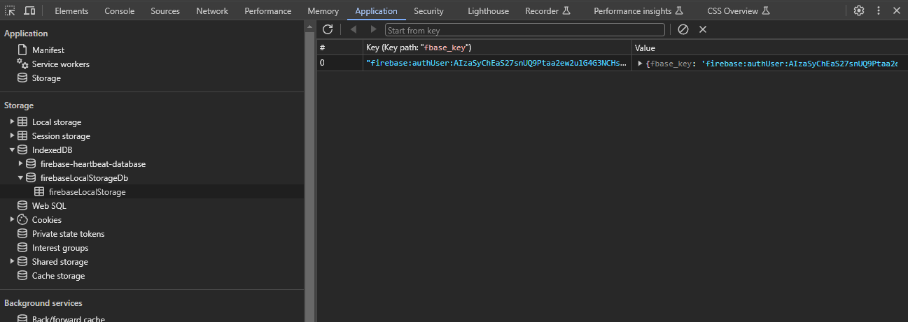

<div align="center">
  <h1> Table of Contents </h1>
</div>

1. [Development Setup](#development-setup)  
   1.1. [Dependency Gathering](#dependency-gathering)  
   1.2. [Starting the Development Server](#starting-the-development-server)  
   1.3. [Environment Variables](#environment-variables)  

2. [Tooling Architecture](#tooling-architecture)  
   2.1. [Vite](#vite)  
   2.2. [React](#react)  
   2.3. [TypeScript](#typescript)  
   2.4. [CSS](#css)  
   &nbsp;&nbsp;&nbsp;&nbsp;2.4.1. [Tailwind CSS](#tailwind-css)  
   &nbsp;&nbsp;&nbsp;&nbsp;2.4.2. [DaisyUI](#daisyui)  
   &nbsp;&nbsp;&nbsp;&nbsp;2.4.3. [styled-components](#styled-components)  

3. [Code Architecture](#code-architecture)  
   3.1. [Routing](#routing)  
   &nbsp;&nbsp;&nbsp;&nbsp;3.1.1. [Routing in a Single Page Application](#routing-in-a-single-page-application)  
   &nbsp;&nbsp;&nbsp;&nbsp;3.1.2. [Routing Architecture](#routing-architecture)  
   &nbsp;&nbsp;&nbsp;&nbsp;3.1.3. [Routing Configuration](#routing-configuration)  
   3.2. [Authorization](#authorization)  

4. [Contribution](#contribution)  
   4.1. [UI Components](#ui-components)  
   4.2. [Atomic Design Structure](#atomic-design-structure)  
   &nbsp;&nbsp;&nbsp;&nbsp;4.2.1. [Atoms](#atoms)  
   &nbsp;&nbsp;&nbsp;&nbsp;4.2.2. [Molecules](#molecules)  
   &nbsp;&nbsp;&nbsp;&nbsp;4.2.3. [Organisms](#organisms)  
   4.3. [Services](#services)  
   4.4. [Import Sorting](#import-sorting)  
   4.5. [Coding Style](#coding-style)  


<div align="center">
  <h1> Development Setup </h1>
</div>

#### Dependency Gathering

Dependency management is done via `npm`. The dependencies are listed inside of `package.json` and are gathered by using the command `npm install`.

#### Starting the Development Server

To start the server, run the command `npm run dev`. This will run the `dev` command configured inside of `package.json` under the `"scripts"` sections.

```JSON
  "scripts": {
    "dev": "vite",
    ...
  }
```

#### Environment Variables

Vite supports the use of environment variables to inject dynamic values into the source code at build time. These values can differ across environments and modes (`development`, `production`, `test`, ...).

By convention, Vite loads environment variables from special `.env` files located in the root of the project. These variables are statically replaced during build time, enabling the bundler to optimize the resulting code by eliminating unused branches or code paths.

Vite supports the following naming conventions for environment variables,

| Filename            | Loaded In                   | Purpose                            |
| ------------------- | --------------------------- | ---------------------------------- |
| `.env`              | All modes                   | Shared variables                   |
| `.env.local`        | All modes (ignored by Git)  | Developer-specific overrides       |
| `.env.development`  | Development mode only       | Variables specific to development  |
| `.env.production`   | Production mode only        | Variables specific to production   |
| `.env.[mode].local` | Specific mode (Git ignored) | Local overrides for specific modes |


Vite determines the active mode via the `--mode` CLI flag or defaults to `development` when running the dev server via `vite dev`. To prevent accidental leakage of sensitive information into the client-side bundle, Vite uses a strict naming convention, **only variables prefixed with** `VITE_` **are exposed to the application** through `import.meta.env`.

Therefore, `npm run dev` or `npm run dev --mode development` will automatically load,

- `.env`
- `.env.local`
- `.env.development`
- `.env.development.local`

Within this base project I primarily have configured `.env.development`.

`.env.development`

```ini
VITE_API_END_POINT=https://localhost:1337
SECRET_KEY=should_not_be_exposed
```

`example.com`
```JavaScript
console.log(import.meta.env.VITE_API_END_POINT); // accessible
console.log(import.meta.env.SECRET_KEY);         // undefined
```

<div align="center">
  <h1> Tooling Architecture </h1>
</div>

#### Vite

Vite is a modern frontbuild tool that offers fast development and optimized production builds by leveraging native ES modules and advanced tooling. Before tools like Vite you would likely use Webpack, Parcel or similar. These tools,

1. Bundle the entire app upfront, even for development.
2. Parse and transform all files on startup.
3. Are often slow to start, especially as projects grow.
4. Have slower Hot Module Replacement (HMR) due to full/partial re-bundling.
5. Require heavy configuration to support modern JS features, TypeScript, CSS Modules etc.

Vite fixes the above by fundamentally changing the development model and optimizing the production build process. **Vite is a build tool that,**

1. Starts a development server that serves source files instantly.
2. Processes files (like `.ts`, `.jsx`, `.scss`) using fast transform via esbuild during development.
3. Uses native ESM (ES modules) in the browser, instead of bundling everything first.
4. Provides fast Hot Module Replacement (HMR) for live updates without full reload.
5. Uses Rollup to bundle your code for production, applying optimizations like tree-shaking and minification.

#### React

This project utilizes React to construct the user interface. All components are implemented using function-based components, in alignment with the current best practices recommended by the official React documentation.

Functional components are favored over class-based components due to their:

- Simpler and more concise syntax

- Better support for composition

- Integration with React Hooks for managing state, side effects, and lifecycle behavior

#### TypeScript

This project is written in TypeScript rather than vanilla JavaScript. TypeScript was selected to enhance code quality, reliability, and maintainability through static type checking.

Using TypeScript provides several key advantages:

- **Improved debugging and developer tooling** through compile-time error detection

- **Better editor support**, including autocompletion, type inference, and inline documentation

- **Safer refactoring** by enabling the compiler to catch type-related errors early

- **Stronger code contracts**, which promote clearer APIs and more predictable behavior

This decision aligns with modern frontend development practices and contributes to a more robust and maintainable codebase over time.

####  CSS

This project uses a combination of **Tailwind CSS, DaisyUI** and **styled-components** to handle styling and UI design.

##### Tailwind CSS

Tailwind CSS is a utility-first CSS framework that allows developers to style elements directly in the markup using predefined utility classes. It promotes rapid development and consistency by avoiding the need to write custom CSS for common styling needs.

```HTML
<div className="bg-white p-4 shadow-md rounded-lg">
  ...
</div>
```

##### DaisyUI

DaisyUI is a component library built on top of Tailwind CSS. It provides a set of pre-designed, accessible UI components (buttons, cards, inputs, modals, ...) that inherit Tailwinds utility-first styling approach.

It simplifies development by allowing developers to use class-based components such as,

```HTML
<button className="btn btn-primary"> Save </button>
```

This helps reduce repetitive UI markup while maintaining the flexibility of Tailwinds customization.

##### styled-components

styled-components is a CSS-in-JS library that enables developers to define component-level styles using tagged template literals in JavaScript or TypeScript. It allows styles to be colocated with the component logic, enhancing encapsulation and maintainability.

```TSX
import React from "react";
import styled from "styled-components";

// Define the styled component
const Separator = styled.div`
  border-top: 2px solid #dadde1;
  margin: 20px 16px;
  width: 100%;
`;

// Use the styled component inside a React component
const ExampleComponent: React.FC = () => {
  return (
    <div>
      <p> Content above the separator </p>
      <Separator />
      <p> Content below the separator </p>
    </div>
  );
};

export default ExampleComponent;
```

This approach is used in the project for quick creation of reusable, styled HTML elements where Tailwind or DaisyUI may not be ideal or expressive enough.

<div align="center">
  <h1> Code Architecture </h1>
</div>

#### Mobile Responsiveness

All components follow a mobile first methodology where base styles target mobile devices and responsive variants are applied at larger breakpoints.

For example, a component might use `flex-col md:flex-row` to display content vertically on mobile devices and horizontally on medium screens and above. This ensures optimal usability on smaller screens while taking advantage of additional space on larger displays.

```HTML
<div class="flex flex-col md:flex-row gap-4">
  <div class="w-full md:w-1/2"> Mobile: full width, Desktop: half width </div>
  <div class="w-full md:w-1/2"> Mobile: full width, Desktop: half width </div>
</div>
```

Mobile responsiveness extends beyond layout to visual assets. SVG background images may require multiple versions to maintain proper visual hierarchy across different aspect ratios. When a single image is stretched or cropped to fit various screen dimensions, important visual elements may be compromised.

This project uses the HTML `<picture>` element with `<source>` and `` tags to serve different images based on device characteristics.

```HTML
const LoginPageBackground = () => (
  <picture>
    <source
      media="(orientation: landscape)"
      srcSet="/homepage_background_desktop_16_9.svg"
    />
    
  </picture>
);
```

1. The browser evaluates each `<source>` tag in order from top to bottom.
2. For each `<source>` it checks if the `media` query is a match and if the browser supports the format.
3. If a `<source>` matches it uses the `srcSet` from that `<source>` and **ignores the** ``.
4. If no `<source>` matches, the browser falls back to the ``s `src`.

```CSS
@media (orientation: landscape) {
  /* Applies when width >= height */
}

@media (orientation: portrait) {
  /* Applies when height > width */
}
```


#### Routing

##### Routing in a Single Page Application

Routing in a Single Page Application (SPA) enables navigation between different views or components based on the URL path **without triggering a full page reload**. In React applications, routing is typically handled using the `react-router-dom` library, which provides a declarative API for mapping URL paths to React components and managing navigation state.

##### Routing Architecture

This project uses the `createBrowserRouter` API from React Router to define a hierarchical routing configuration. The structure separates routes into two categories,

- **Public routes** - Accessible without authentication.
- **Protected routes** - Accessible only to authenticated users.

Access control for protected routes is enforced using a custom `ProtectedRoute` component.

##### Routing Configuration

```TSX
const router = createBrowserRouter([
  {
    path: "/login",
    element: <LoginPage />,
  },
  {
    element: <ProtectedRoute />,
    children: [
      {
        path: "/",
        element: <HomePage />,
      },
      {
        path: "weight_tracking",
        element: <WeightTrackingPage />,
      },
      // Additional protected routes...
    ],
  },
]);
```

- `path` - Defines the URL segment for the route.
- `element` - Specifies the React component to render when the route is matched.
- `children` - Defines nested routes beneath the parent route.

In this setup,

- The `/login` route is public and renders the `LoginPage` component.
- All other routes are nested under `ProtectedRoute`, which guards access to authenticated areas of the application.

The `ProtectedRoute` component is responsible for verifying user authentication. If the user is authenticated, it renders an `<Outlet />`, which is a placeholder for the matched child routes component. If not, it redirects the user to the login page using `<Navigate to="/login" />`. When a route defines both `element` and `children`, React Router renders the parents `element` first and then injects the child routes `element` via `<Outlet />`. Effectively, `ProtectedRoute` acts as a gatekeeper. It renders no content of its own except for `<Outlet />`, which will render the matched child route if authenticated.


#### Authorization

Firebase is used to deal with the process of account creation, logging in the user in, etc. When the user successfully logins we receive a JWT (JSON Web Token) from [Firebase](https://firebase.google.com/docs/auth/admin/verify-id-tokens#retrieve_id_tokens_on_clients), this is referred to as the "ID token". This ID Token uniquely identifies a user and grants them access to resources from our backend. The JWT also contains information about the user such as the UID, this is utilized on the backend. Losing the ID Token can lead to session hijacking and it is crucial to not expose this information.

- Firebase is initialized by importing `firebase.ts` inside of `main.tsx`.

- All of the Authorzation logic is encapsulated inside of `AuthContext.tsx`.

- Additional creation of calls to the Firebase API need to be defined inside of `services/FireBaseUtils.ts`.

When the user first creates an account, we make a call to the Firebase API by calling `signInWithEmailAndPassword` inside the Firebase services. Once the account has been created, the user will automatically be logged in. This will then call `onAuthStateChanged` and update the user state inside the `authContext`.

When we refresh the page and the user is already logged in, during the initialization of Firebase inside of the `firebease.ts`, Firebase will check for Cookies for the loggedin state of the user. Firebase will then call `onAuthStateChanged` again and from there we can restore the user to the loggedin state.

Using Google Chrome, below is an example of Firebase storing the current user state.




<div align="center">
  <h1> Contribution </h1>
</div>

#### UI Components

This project leverages **Material-UI (MUI)**, a widely adopted React component library that implements Google's Material Design specifications. Commonly used MUI components in this codebase includes buttons, input fields and form controls providing a consistent and accessible UI foundation.

#### Atomic Design Structure

The UI components follow the **Atomic Design** methodology, organized into three hierarchical layers to promote reusability and maintainaibility.


##### Atoms

Located in `src/atoms`, **atoms are the smallest, most fundamental building blocks of the UI**. They represent simple, highly reusable components such as buttons, inputs, labels and icons. Atoms are intentionally designed to be stateless and free of business logic, serving as raw elements used to compose more complex components.

##### Molecules

Molecules are **composed of one or more atoms combined to form more complex, self-contained UI elements**. Examples include a password input field with an associated visibility toggle or a search bar component. Molecules encapsulate minimal logic required to manage interactions between their consituent atoms.

##### organisms

Organisms are **relatively complex, functional UI sections that group multiple molecules and atoms**. An example is a login form comprising input fields, buttons, validation messages and other interactive elements. Organisms often encapsulate business logic and serve as key building blocks of pages or features.

#### Services

The `src/services` directory contains modules responsible for interacting with the backend APIs. These modules encapsulate HTTP request logic for fetching, updating and managing user data and other external resources, thereby separating data access concerns from UI components.

#### Import Sorting

Import statements throughout the codebase follow a consistent order enforced by the [TypeScript Import Sorter](https://marketplace.visualstudio.com/items?itemName=mike-co.import-sorter) Visual Studio Code extension. This ensures a clean, maintainable import structure.

#### Coding Style

JavaScript identifiers use **camelCase** notation consistently, following standard JavaScript conventions for variables and function names.