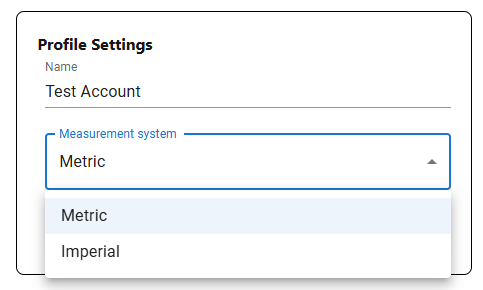
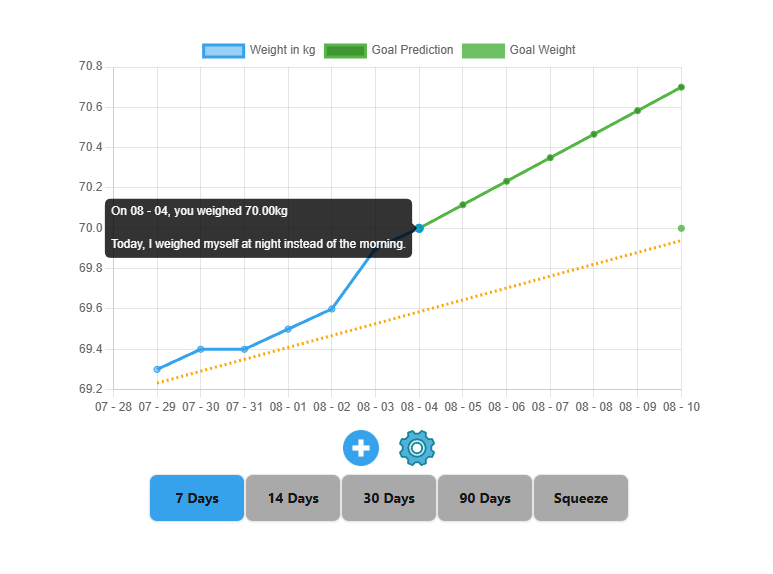
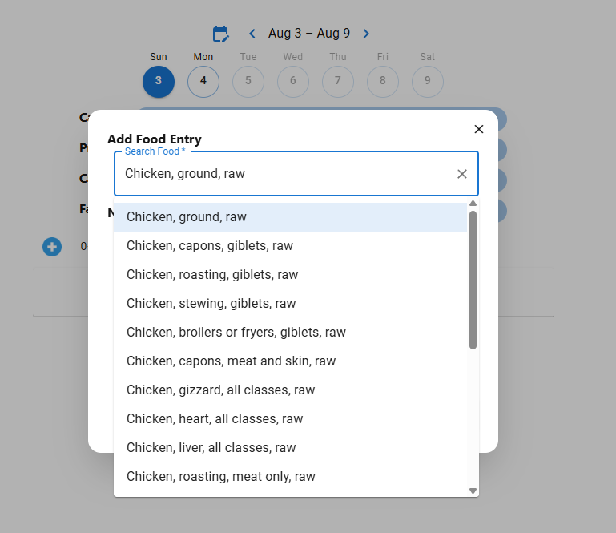
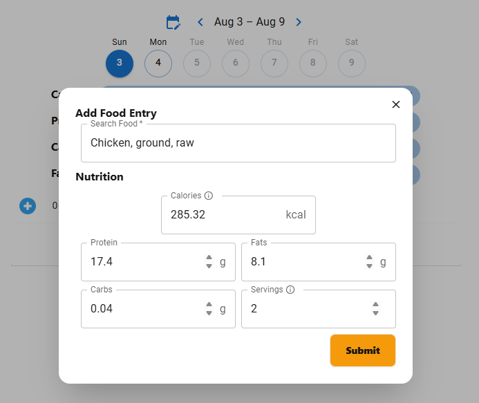
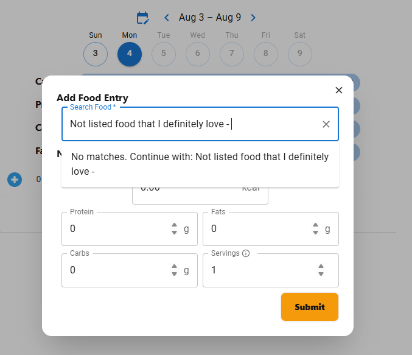
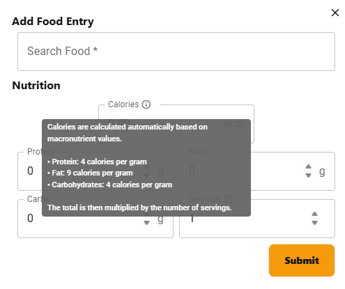
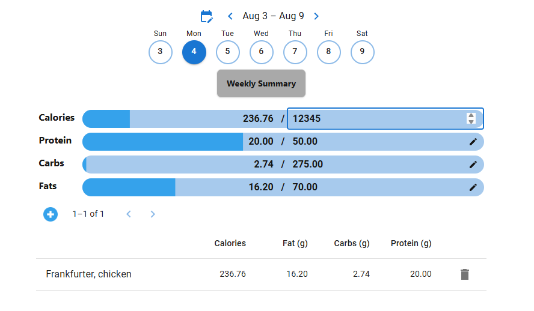
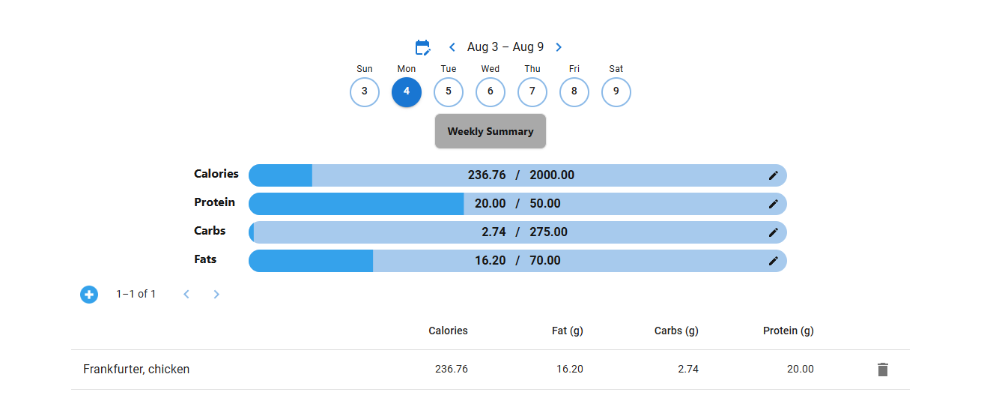
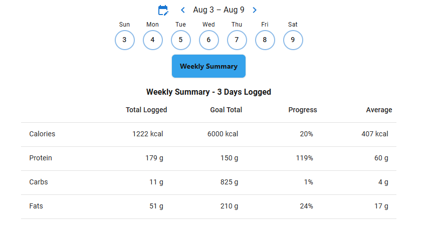

    <h1> Radix Fitness - Frontend

## Developer Documentation

This is the frontend web application for Radix Fitness, a health and fitness tracking platform. Radix Fitness interfaces with the [Radix Fitness backend](https://github.com/Michael-Cowie/RadixFitnessBackend) API.

Developer documentation can be found within the `docs` folder. This includes folder includes numerous information about the current project architecture, environment setup and educational information.

## Website Overview

The Radix Fitness website offers a range of features for any user to securely login and track their health status and food intake, with more to come! Radix Fitness also offers the ability to support switching between measurement systems with ease which is selected on account creation or within the user profile settings.

    

#### Weight Tracking

The first feature of Radix Fitness is based around weight tracking. This includes the ability to optionally,

1. **Track Weight** - Track the users weight on a specific date with the optional ability to includes notes.
2. **Goal Weight Configuration** - Allow a user to set a specified goal weight on a specified date.
3. **Goal Weight Prediction** - Goal predictions are calculated using your recent weight trend. We measure your average daily change (gain or loss) from the visible data points and project it forward to your goal date. Meaning, the more graph entries you have, the smoother the weight prediction will become.
4. **Trendline** - Enable a trendline over the graph dataset.
5. **Configurable Date Ranges** - The graphed data has a set of configurable days `7`, `14,`, `30` and `90`. This will display the graph data from the present date to `x` days before it. Additionally, the `Squeeze` option will condense the graph dataset so that no dates are shown without a datapoint.

    

#### Intake Tracking

Users often want to track daily macronutrients and food intake through the day. I have offered the ability to do so in Radix Fitness.

1. **Search Foods By Name** - Users can search for foods by name, which retrieves detailed macronutrient information from the [USDA FoodData Central](https://fdc.nal.usda.gov/) API. The retrieved values automatically populate the input fields, while still allowing for manual adjustment if necessary.

    

    

2. **Manually Enter Food** - If a food item cannot be found via search, users can manually enter all relevant macronutrient data.

    

4. **Autocalculated Fields** - Calories are automatically calculated based on the entered macronutrient values using standard calorie conversion formulas. This field updates instantly and does not require manual input. Additionally, the number of servings is used to scale the calorie value appropriately.

    

5. **Change Date With Ease** - Users can easily switch between days within the current week. For dates further in the past, a calendar picker is available for quick navigation.

6. **Daily Goal Macronutrient Intake** - Daily macronutrient intake goals can be customized by clicking the edit icon. This allows users to tailor their nutritional targets to their personal needs.

    

7. **Daily Progress Tracking** - When the user has added entries, they will appear in the table. Their progress will be visible for each macronutrient using the progress bar.

    

8. **Weekly Summary** - It's important for users and is extremely common to consider weekly averages. One day a user may want to go over and the another day go under, but in the long term weekly averages are important to determine if they went over or under they goal. This is the important of a weekly summary and can be can be easily visile by selecting the "Weekly Summary" button. This will display the number of days in the week have entries and their statistics.

    

