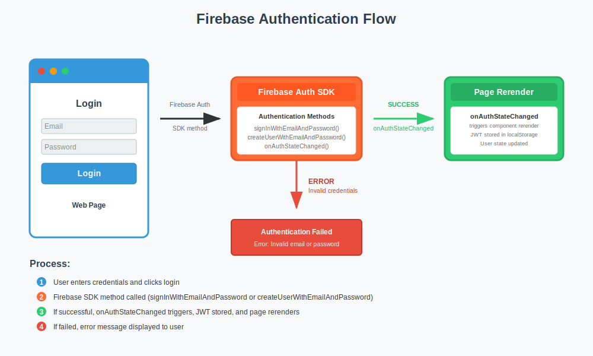
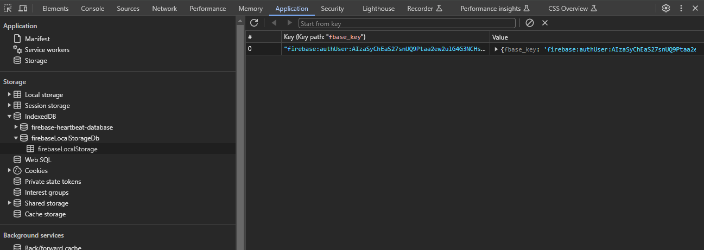

    <h1> User Authentication </h1>

Firebase is used to deal with the process of account creation, logging in the user in, etc. When the user successfully logins we receive a JWT (JSON Web Token) from [Firebase](https://firebase.google.com/docs/auth/admin/verify-id-tokens#retrieve_id_tokens_on_clients), this is referred to as the "ID token". This ID Token uniquely identifies a user and grants them access to resources from our backend. The JWT also contains information about the user such as the UID, this is utilized on the backend. Losing the ID Token can lead to session hijacking and it is crucial to not expose this information.

- Firebase is initialized by importing `firebase.ts` inside of `main.tsx`.

- All of the Authorzation logic is encapsulated inside of `AuthContext.tsx`.

- Additional creation of calls to the Firebase API need to be defined inside of `services/FireBaseUtils.ts`.

When the user first creates an account, we make a call to the Firebase API by calling `signInWithEmailAndPassword` inside the Firebase services. Once the account has been created, the user will automatically be logged in. This will then call `onAuthStateChanged` and update the user state inside the `authContext`.

When we refresh the page and the user is already logged in, during the initialization of Firebase inside of the `firebease.ts`, Firebase will check for Cookies for the loggedin state of the user. Firebase will then call `onAuthStateChanged` again and from there we can restore the user to the loggedin state.

    

Using Google Chrome, below is an example of Firebase storing the current user state.

    

