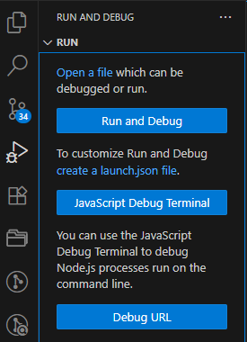
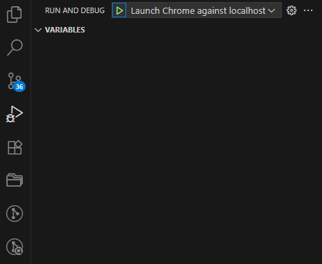

<div align="center">
  <h1> Development Setup </h1>
</div>

## 1. Dependency Gathering

Dependency management is done via `npm`. The dependencies are listed inside of `package.json` and are gathered by using the command `npm install`.

## 2. Environment Variables

Vite supports the use of environment variables to inject dynamic values into the source code at build time. These values can differ across environments and modes (`development`, `production`, `test`, ...).

By convention, Vite loads environment variables from special `.env` files located in the root of the project. These variables are statically replaced during build time, enabling the bundler to optimize the resulting code by eliminating unused branches or code paths.

Vite supports the following naming conventions for environment variables,

| Filename            | Loaded In                   | Purpose                            |
| ------------------- | --------------------------- | ---------------------------------- |
| `.env`              | All modes                   | Shared variables                   |
| `.env.local`        | All modes (ignored by Git)  | Developer-specific overrides       |
| `.env.development`  | Development mode only       | Variables specific to development  |
| `.env.production`   | Production mode only        | Variables specific to production   |
| `.env.[mode].local` | Specific mode (Git ignored) | Local overrides for specific modes |


Vite determines the active mode via the `--mode` CLI flag or defaults to `development` when running the dev server via `vite dev`. To prevent accidental leakage of sensitive information into the client-side bundle, Vite uses a strict naming convention, **only variables prefixed with** `VITE_` **are exposed to the application** through `import.meta.env`.

Therefore, `npm run dev` or `npm run dev --mode development` will automatically load,

- `.env`
- `.env.local`
- `.env.development`
- `.env.development.local`

Within this base project I primarily have configured `.env.development`.

`.env.development`

```ini
VITE_API_END_POINT=https://localhost:1337
SECRET_KEY=should_not_be_exposed
```

`example.com`
```JavaScript
console.log(import.meta.env.VITE_API_END_POINT); // accessible
console.log(import.meta.env.SECRET_KEY);         // undefined
```

## 3. Import Sorting

Import statements throughout the codebase follow a consistent order enforced by the [TypeScript Import Sorter](https://marketplace.visualstudio.com/items?itemName=mike-co.import-sorter) Visual Studio Code extension. This ensures a clean, maintainable import structure.

## 4. Debugging in Visual Studio Code

##### Create a `launch.json` File

<div align="center">
    
</div>

##### Click `Web App (Chrome)`

<div align="center">
    
</div>

#### Fix the `launch.json` Default

The `launch.json` file will be created under `.vscode`. The default port in the `launch.json` will be `8080`. The default port for Vite will be `5173`. Therefore, update the port to be `5173`.

```JSON
"url": "http://localhost:5173",
```

#### Launch the Debugger

<div align="center">
    
</div>

## 5. Starting the Development Server

To start the server, run the command `npm run dev`. This will run the `dev` command configured inside of `package.json` under the `"scripts"` sections.

```JSON
  "scripts": {
    "dev": "vite",
    ...
  }
```
