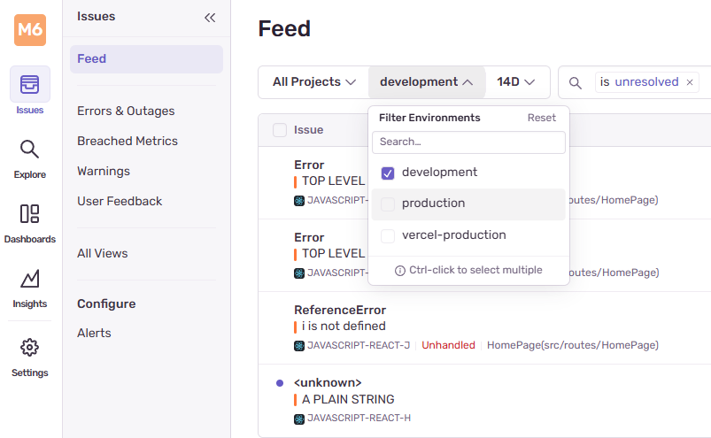

<div align="center">
  <h1> Project Architecture </h1>
</div>

## Vite

Vite is a modern frontbuild tool that offers fast development and optimized production builds by leveraging native ES modules and advanced tooling. Before tools like Vite you would likely use Webpack, Parcel or similar. These tools,

1. Bundle the entire app upfront, even for development.
2. Parse and transform all files on startup.
3. Are often slow to start, especially as projects grow.
4. Have slower Hot Module Replacement (HMR) due to full/partial re-bundling.
5. Require heavy configuration to support modern JS features, TypeScript, CSS Modules etc.

Vite fixes the above by fundamentally changing the development model and optimizing the production build process. **Vite is a build tool that,**

1. Starts a development server that serves source files instantly.
2. Processes files (like `.ts`, `.jsx`, `.scss`) using fast transform via esbuild during development.
3. Uses native ESM (ES modules) in the browser, instead of bundling everything first.
4. Provides fast Hot Module Replacement (HMR) for live updates without full reload.
5. Uses Rollup to bundle your code for production, applying optimizations like tree-shaking and minification.

## React

This project utilizes React to construct the user interface. All components are implemented using function-based components, in alignment with the current best practices recommended by the official React documentation.

Functional components are favored over class-based components due to their:

- Simpler and more concise syntax

- Better support for composition

- Integration with React Hooks for managing state, side effects, and lifecycle behavior

## TypeScript

This project is written in TypeScript rather than vanilla JavaScript. TypeScript was selected to enhance code quality, reliability, and maintainability through static type checking.

Using TypeScript provides several key advantages:

- **Improved debugging and developer tooling** through compile-time error detection

- **Better editor support**, including autocompletion, type inference, and inline documentation

- **Safer refactoring** by enabling the compiler to catch type-related errors early

- **Stronger code contracts**, which promote clearer APIs and more predictable behavior

This decision aligns with modern frontend development practices and contributes to a more robust and maintainable codebase over time.

## Sentry

Sentry is an open-source error monitoring and performance tracing tool used to track runtime exceptions and performance bottlenecks in web applications. In this project, Sentry is integrated for production debugging, allowing developers to identify, capture, and diagnose issues that occur in real user sessions.

By logging both handled and unhandled errors, Sentry helps maintain application stability and speeds up the debugging process by providing detailed stack traces, context, and user/environment metadata.

Sentry relies on two environment variables to be configured correctly,

1. `VITE_SENTRY_DSN` - This environment variables determines where to send events so they're assoicated with the correct project.
2. `SENTRY_AUTH_TOKEN` - This environment variables acts as authentication for sending the events.

Sentry configuration occurs on application startup,

```TS
Sentry.init({
  dsn: import.meta.env.VITE_SENTRY_DSN,
  environment: import.meta.env.MODE,
});
```

The Vite environment variable `MODE` is used to determine grouping tags for Sentry. `MODE` will have the value `development` during local development and `production` in a production environment.

<div align="center">
  
</div>

Sentry is imported and used globally across the application to capture exceptions and report errors.

```TS
import * as Sentry from '@sentry/react';
```

Sentry is commonly used within `.catch()` blocks to record failed asynchronous operation failures. This is especially important to understand and log why certain API requests failed. Albeit their are many instances throughout the application there `.catch()` is expected to occur if the user does not have data and initializes the component to a default state. In these instances, it's still logged as other situations can case it to be raised. Sentry groups the identical exceptions in these occurences so it does not float the exceptions with the same occurrence.

```TS
someApiCall()
  .then((response) => {
    ...
  })
  .catch((error) => {
    Sentry.captureException(error);
    ...
  });
```

By default, Sentry will also log top level uncaught exceptions too.

## CSS

This project uses a combination of **Tailwind CSS, DaisyUI** and **styled-components** to handle styling and UI design.

#### Tailwind CSS

Tailwind CSS is a utility-first CSS framework that allows developers to style elements directly in the markup using predefined utility classes. It promotes rapid development and consistency by avoiding the need to write custom CSS for common styling needs.

```HTML
<div className="bg-white p-4 shadow-md rounded-lg">
  ...
</div>
```

#### DaisyUI

DaisyUI is a component library built on top of Tailwind CSS. It provides a set of pre-designed, accessible UI components (buttons, cards, inputs, modals, ...) that inherit Tailwinds utility-first styling approach.

It simplifies development by allowing developers to use class-based components such as,

```HTML
<button className="btn btn-primary"> Save </button>
```

This helps reduce repetitive UI markup while maintaining the flexibility of Tailwinds customization.

#### styled-components

styled-components is a CSS-in-JS library that enables developers to define component-level styles using tagged template literals in JavaScript or TypeScript. It allows styles to be colocated with the component logic, enhancing encapsulation and maintainability.

```TSX
import React from "react";
import styled from "styled-components";

// Define the styled component
const Separator = styled.div`
  border-top: 2px solid #dadde1;
  margin: 20px 16px;
  width: 100%;
`;

// Use the styled component inside a React component
const ExampleComponent: React.FC = () => {
  return (
    <div>
      <p> Content above the separator </p>
      <Separator />
      <p> Content below the separator </p>
    </div>
  );
};

export default ExampleComponent;
```

#### UI Components

This project leverages **Material-UI (MUI)**, a widely adopted React component library that implements Google's Material Design specifications. Commonly used MUI components in this codebase includes buttons, input fields and form controls providing a consistent and accessible UI foundation.

<div align="center">
  <h1> Folder Structure </h1>
</div>

This approach is used in the project for quick creation of reusable, styled HTML elements where Tailwind or DaisyUI may not be ideal or expressive enough.

#### Atomic Design Structure

The UI components follow the **Atomic Design** methodology, organized into three hierarchical layers to promote reusability and maintainaibility.

#### Atoms

Located in `src/atoms`, **atoms are the smallest, most fundamental building blocks of the UI**. They represent simple, highly reusable components such as buttons, inputs, labels and icons. Atoms are intentionally designed to be stateless and free of business logic, serving as raw elements used to compose more complex components.

#### Molecules

Molecules are **composed of one or more atoms combined to form more complex, self-contained UI elements**. Examples include a password input field with an associated visibility toggle or a search bar component. Molecules encapsulate minimal logic required to manage interactions between their consituent atoms.

#### organisms

Organisms are **relatively complex, functional UI sections that group multiple molecules and atoms**. An example is a login form comprising input fields, buttons, validation messages and other interactive elements. Organisms often encapsulate business logic and serve as key building blocks of pages or features.

#### Services

The `src/services` directory contains modules responsible for interacting with the backend APIs. These modules encapsulate HTTP request logic for fetching, updating and managing user data and other external resources, thereby separating data access concerns from UI components.

#### Images

Images throughout the application are stored are stored in the `public` directory. The contents of the `public/` folder are copied as-is to the root server

So if we have,

```cpp
public/
└── blank_profile.svg
```

Then it is available at,

```bash
http://localhost:5173/blank_profile.svg
```

The correct way to reference public assets is to **always use absolute paths** from the root.

```tsx

```

This guarantees the browser requests,

```
http://localhost:5173/blank_profile.svg
```

Accidentally doing relative routes such as `./blank_profile.svg` will make the browser search for the image relative for the current URL, e.g. `www.localhost:5137/profile/settings` will make the browser search for the svg at `/profile/blank/blank_profile.svg`, leading to images not being found.

#### Lib

The Lib folder holds code that can be used throughout the codebase or utility functions.

Examples include,

1. `statePersistence.ts` - Utility functions to store UI states that should not require database persistance such as having a checkbox selected. This is helpful for the user to refresh the page and keep state.

2. `dateUtils.ts` - Utility functions for calculations related for date calculations.

3. `colours.module.css` - A one place definition for colours used throughout the application that can be accessed in child CSS modules through using variable names.

The module will be imported as,

```TSX
import styles from 'lib/colours.module.css';

<button className={ `btn ${ styles.blueWithHover }`} </button>
```

#### Context

Contains the [React contexts](https://react.dev/reference/react/useContext).
