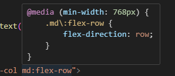

<div align="center">
  <h1> Mobile Responsive Design </h1>
</div>

All components in this project follow a mobile first methodology where base styles target mobile devices and responsive variants are applied at larger breakpoints. For an overview of CSS responsive design, I have written up a concise document [explanining the basics.](https://github.com/Michael-Cowie/Notes/blob/main/Web/CSS/responsive_design.md).

#### Mobile Responsive Layout

A component might use `flex-col md:flex-row` to display content vertically on mobile devices and horizontally on medium screens and above. This ensures optimal usability on smaller screens while taking advantage of additional space on larger displays.

```HTML
<div class="flex flex-col md:flex-row gap-4">
  <div class="w-full md:w-1/2"> Mobile: full width, Desktop: half width </div>
  <div class="w-full md:w-1/2"> Mobile: full width, Desktop: half width </div>
</div>
```

Here, `flex-col` is applied by default. This means by default we're targeting the behaviour for mobile devices, which is to layout the two child elements column wise. Behind the scenes Tailwind CSS uses media queries to dynamically alter the CSS applied to the element. Below we can observe the actual CSS code for `md:flex-row` which means that when a scree

<div align="center">
  
</div>

#### Mobile Responsive Components

While changing the width and layout of components is sufficient for many usecases for mobile responsiveness, in some cases we need to do a significant amount of changes and it is significantly more readable to break them down into two separates components and dynamically choose which one to disable.

To do this we need to create two separates containers. The mobile container will be shown with a comment and have the CSS `block sm:hidden`. This means, it will by default be visible and behave as a block element. When the width is large enough, this component will be hidden. Then, the desktop layout will have the opposite CSS `hidden sm:block`. This means by default it will be hidden and when the width is large enough (The identical width to when the mobile layout is hidden) it will become visible.

```JSX
{/* Mobile layout  */}
<div className="block sm:hidden">
  ...
</div>

{/* Desktop layout */}
<div className="hidden sm:block">
  ...
</div>
```

For components with significant changes to which the above will bloat a same file, it can be necessary to create an entirely new component. However, the CSS logic is still identical.

```JSX
<div className="block sm:hidden">
  <MobileVersion />
</div>

<div className="hidden sm:block">
  <DesktopVersion />
</div>
```

#### Mobile Responsive Image Changing

Mobile responsiveness extends beyond layout to visual assets. SVG background images may require multiple versions to maintain proper visual hierarchy across different aspect ratios. When a single image is stretched or cropped to fit various screen dimensions, important visual elements may be compromised.

This project uses the HTML `<picture>` element with `<source>` and `` tags to serve different images based on device characteristics.

```HTML
const LoginPageBackground = () => (
  <picture>
    <source
      media="(orientation: landscape)"
      srcSet="/homepage_background_desktop_16_9.svg"
    />
    
  </picture>
);
```

1. The browser evaluates each `<source>` tag in order from top to bottom.
2. For each `<source>` it checks if the `media` query is a match and if the browser supports the format.
3. If a `<source>` matches it uses the `srcSet` from that `<source>` and **ignores the** ``.
4. If no `<source>` matches, the browser falls back to the ``s `src`.

```CSS
@media (orientation: landscape) {
  /* Applies when width >= height */
}

@media (orientation: portrait) {
  /* Applies when height > width */
}
```
