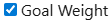
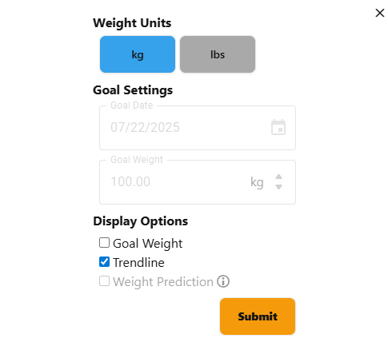
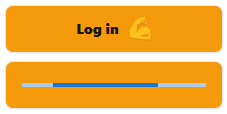
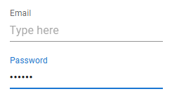
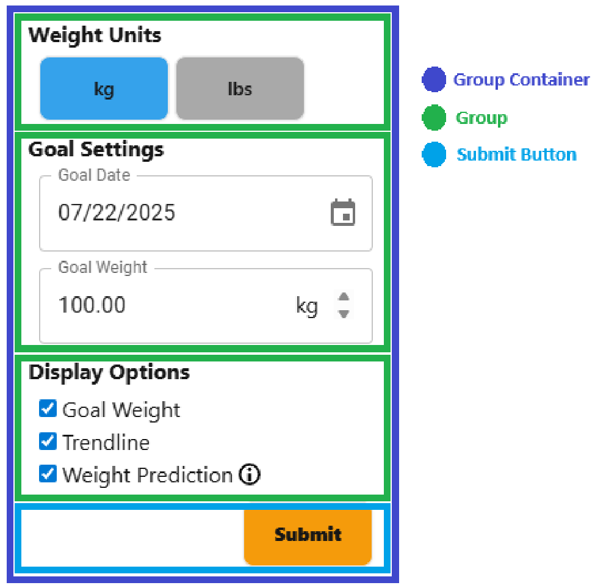

<div align="center">
    <h1> Consistent and Maintainable Interfaces </h1>
</div>

Modern front-end applications grow quickly in complexity. As features expand, so do the risks of UI inconsistencies, duplicated code and diverging interaction behaviours. Without clear patterns for structuring interface elements, developers often resort to ad hoc implementations of common UI elements such as checkboxes, grouped inputs, buttons and layout structures. Overtime, this leads to fragmented styling, reduced usability and increased maintenance burden over time.

In large or long-lived applications, the cost of this inconsitency compounds. Teams may unintentionally reimplement the same logic with subtle differences, such as varying label alignments, spacing discrepancies or accessibility oversights. This not only harms the user experiences but also makes the codebase hard to reason about, test and extend.

To address these challenges, this project introduces a centralized set of UI design patterns - a collection of composable, reusable components encapsulated under the `atoms/design_patterns/` directory. These components act as building blocks for constructing predictable, accessible and aesthetically consistent user interfaces.

## Centering

Having the requirement of both vertical and horizontal centering is a common requirement. To resolve this issue the component `HorizontalVerticalCenteringContainer` can be used. All children within this component will be vertically and horizontally centered. This component also has fixes for vertically centering when the child component has a scrollbar.

```tsx
<HorizontalVerticalCenteringContainer>
  <div> I am vertically and horizontally centered </div>
</HorizontalVerticalCenteringContainer>
```

## Shared Widgets

#### CheckBox

Checkboxes are a frequently used HTML tag and is consistently used alongside a label. The component `CheckBoxWithLabel` is used to create a consistent widget that displays a checkbox alongside a label with a consistent spacing and behaviour.

The CheckBoxWithLabel component provides,

1. A consistent `4px` spacing between the checkbox and the label.
2. Consistent UI behaviour by allowing the checkbox to be selected when hovering the text.

```TSX
<CheckBoxWithLabel label='Goal Weight' checked={ ... } onChange={() => ... )} />
```

<div align="center">
    
</div>

#### Widget Sensitivity

Making a widget insensitive is a technique used to convey to the user that the widget is disabled. The component `SensitivityController` acts as a container that takes the a single prop `sensitive` used to control the visible sensitivty of all children. When `sensitive` is passed as `false`, all children will have reduced opacity applied to them and all mouse events will be ignored.

```tsx
<SensitivityController sensitive={ ... }>
    ...
</SensitivityController>
```

In the following example the `SensitivityController` is used to make,

1. Goal Date widget
2. Goal Weight widget
3. Weight Prediction widget

all insensitive. They will have reduced opacity and not become usable for the user.

<div align="center">
    
</div>

#### Responsive Loading Buttons

When performing an API request after submitting a button such as logging in, it's crucial to convey to the user that we're in a state of waiting. This responsive UI is shown through the `SubmitButtonWithProgress` component. This component takes three parameters,

- `buttonText` - Displayed text on the button.
- `displayLoadingAnimation` - If set to `true`, will display the loading animation. This should be set to `true` when performing a network request.
- `iconSrc` - An optional string to display an image next to the `buttonText`.

<div align="center">
    
</div>

The expected use is to be within a `<form>` that performs the next request and sets the `isLoading` to `true`

```TSX
const onLogin = async(event: React.FormEvent<HTMLFormElement>): Promise<void> => {
    event.preventDefault();

    ...

    setIsLoading(true);

    loginUser(...).then((successful) => {
        ...
    })
};

<form onSubmit={ onLogin }>
    <SubmitButtonWithProgress
        buttonText="Log in"
        displayLoadingAnimation={ isLoading }
        iconSrc={ '/flexing_arm.svg' }
    />
</form>
```

#### Input Fields and Common Widgets

The components throughout this project leverages Material-UI and gain inspriation based around those components. Their exist many components in the `design_patterns` directory that directly use Material-UI components but have consistent layout applied to it through (full width, consistent margin, etc...).

The component `InputWithLabel` is a wrapper for `TextField`.

<div align="center">
    
</div>

## Groups

The purpose of groups is to create a consistent UI outline when creating sections. It is broken down into three main components, `GroupContainer`, `Group` and `SubmitButton`.

- `GroupContainer` - This component is the main container. It is primarily responsible for creating a fixed distance between each `Group` component. The `GroupContainer` is expected to hold a series of `Group` components and an optional `SubmitButton` component at the end for submissions forms.

- `Group` - This component is expected to be a child of `GroupContainer`. It takes a `title` as the prop and is responsible for displaying the title in a consistent way and then displays the child content on the next row with a slight indentation in order to create a visual grouping. The `Group` component can take multiple children and will equally space them.

- `SubmitButton` - When required for form submissions, the `SubmitButton` component will be placed at the very. This will place a button at the very end of the container. The `displayLoadingAnimation` prop should be set to `true` when performing an API request and waiting for a response. This will create a loading line, identical to the responsive loading buttons above.

```tsx
<GroupContainer>
    <Group title='Weight Units'>
        ...
    </Group>

    <Group title='Goal Settings'>
        ...
    </Group>

    <Group title='Display Options'>
        ...
    </Group>

    <SubmitButton displayLoadingAnimation={ ... }/>
</GroupContainer>
```

<div align="center">
    
</div>
