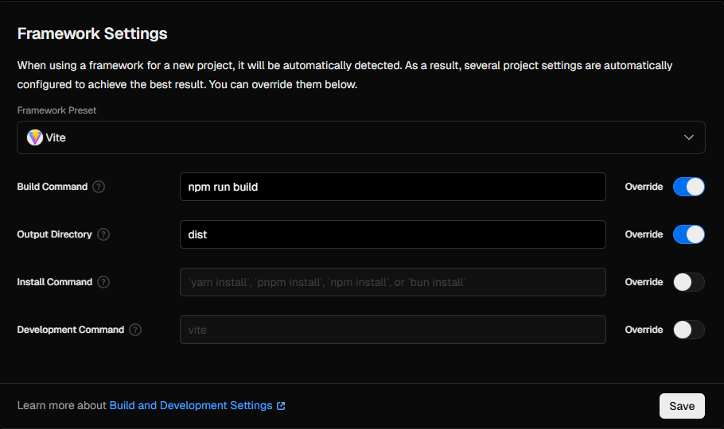
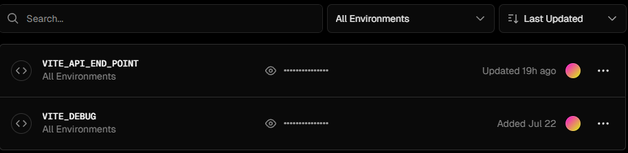
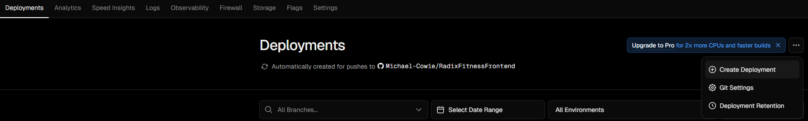

<div align="center">
    <h1> Deployment using Vercel </h1>
</div>

Vercel is a modern cloud platform for hosting frontend applications, optimized for frameworks like React, Next.js and Vite. It provides zero-configuration static hosting and continuous deployment pipelines with global CDN delivery.

Vercel is chosen for the Radix Fitness frontend due to its,

1. Tight GitHub integration, enabling automatic deployments upon each commit.
2. Support for static builds generated by Vite.
3. Instant preview deployments for non-production branches.
4. Built-in environment variable management for secure configuration.
5. Effortless support for client-side routing in SPAs via custom rewrites.

By connecting the GitHub repository to Vercel, developers benefit from seamless CI/CD workflows without needing to manually upload builds or manage infrastructure. Vercel automatically detects changes, builds the project and publishes it to a globally distributed CDN.

In the context of Vite, a static build refers to the output generated from

```nginx
vite build
```

This command produces a production-ready bundle of the application that consistents entirely of static assets, meaning it will include

1. Minified HTML files.
2. Minified JavaScript bundles, e.g. `assets/index-[hash].js`.
3. Optimized CSS (extracted and minified).
4. Any other static assets (images, font, ...).

Static builds do not include any server-side code, because it's a static build there is no backend logic. All data fetching must be done via API calls to the Radix Fitness backend. This is in contrast to dynamic builds (or server rendered build) that requires a server to run because some parts of the application are generated or processed at runtime rather than being able to be pre-built.

By default Vercel uses the build command `vite build` for production bundling. This project has modified the `npm run build` command within `package.json` to invoke the TypeScript compiler to perform checks before production builds are performed. When invoking the TypeScript compiler, it looks inside `tsconfig.json` and if any errors are found, it fails and stop and therefore prevents the build from proceeding.

<div align="center">
    
</div>

## Environment Configuration for Local Development

This project uses `.env.development` file to configure non-sensitive environment variables strictly for local development. This file is committed to the repository intentionally and it does not contain secrets and allow for quicker local development.

```INI
VITE_API_END_POINT=http://localhost:8000
```

This configuration allows the frontend to connect to a locally running Django backend during development. The variable is accessed in code via,

```TypeScript
const apiUrl = import.meta.env.VITE_API_END_POINT;
```

Vite requires that all exposed environment variables be prefixed with `VITE_`. These are statically injected at build time, ensuring they are accessible in the compiled frontend code.

## Production Deployment and Environment Variable Overriding

When deploying to production, the Radix Fitness application is linked to a GitHub repository. During project setup on Vercel, the repository is selected and the `master` branch is set as the production branch. Vercel then monitors this branch for any code changes and triggers a new deployment pipeline on every push.

Unlike development, production configurations are not stored in `.env` files. Instead, they are managed securely through Vercels environment settings. The key `VITE_API_END_POINT` is redefined to point to live backend service. As of now this is currently pointing to the backend hosted on `fly.io`.

<div align="center">
    
</div>

These values are injected at build time only, not at runtime. Therefore any update to environment variables must be followed by a manual deployment. This can be done from the Verfcel Dashboard under the Deployments tab by selecting

<div align="center">
    
</div>

Additionally,

- Feature branches trigger preview deployments, allowing testing before merging to `master`.
- Only the environment values for the relevant deployment environment (Production or Preview) are used during the build.

## Routing Configuration with `vercel.json`

React applications built as SPAs (Single Page Applications) rely on **client-side routing**. This causes issues when a user directly accesses a nested route, e.g. `/dashboard`. This occurs because the server (Vercel) does not recognize this path and may return a 404 error.

To resolve this, a `vercel.json` file is added to the project root.

```json
{
  "routes": [{ "src": "/[^.]+", "dest": "/", "status": 200 }]
}
```

- The `src` pattern `/[^.]+` matches any request that does not include a file extension, which covers typical SPA paths.
- The `dest: "/"` redirects all such requests to the `index.html` file.
- The `status: 200` ensures a valid HTTP success response.

This allows React Router to take over and resolve the path within the browser, preserving expected navigation behaviour and supporting deep linking. Without this configuration, users would encounter broken pages on refresh or direct linking to non-root routes.

## Vercels Build Process for Vite Projects

Vercel is designed to automatically detect frontend framework and build process on common conventions and files. When a new project is created on Vercel and linked to a GitHub repository the following sequence occurs.

#### 1. Framework Detection

Vercel scans the project for recognizeable build tools. Upon detecting `vite` as a dependency in `package.json`, it configures the build accordingly.

#### 2. Build Command

Vercel will run the configured build command and depdency installation.

```bash
npm install
npm run build
```

This executes the Vite build process configured in `package.json`.

```bash
tsx && vite build
```

#### 3. Vite Build Output

The `vite build` process compiles the React application into optimized static assets.

- All JavaScript and CSS are minified.
- Assets are hashed for long-term caching.
- The output is placed in the `dist/` directory.

```bash
dist/
├── index.html
├── assets/
│   ├── index-[hash].css
│   ├── index-[hash].js
│   ├── ...
```

#### 4. Static Deployment

1. Vercel takes the contents of `dist/` and deploys them as a **static site**.
2. These assets are served from Vercels global CDN, ensuring fast access worldwide.
3. If the project contains `vercel.json`, its rules are applied to handle routing and rewrites.
4. Environment variables are injected during this build phase.

#### 5. Cache and Incremental Deploys

Vercel caches dependencies between builds, significantly reducing build time. Only the affected files and pages are redeployed, improving deployment efficiency.